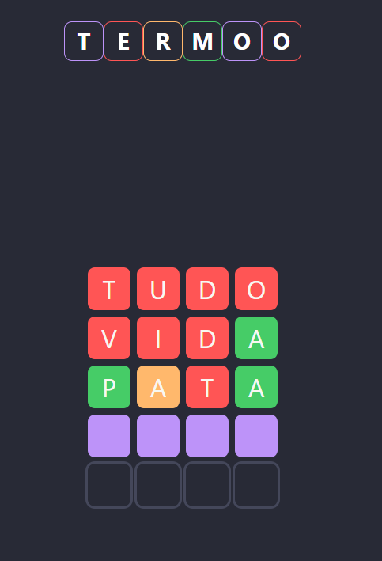
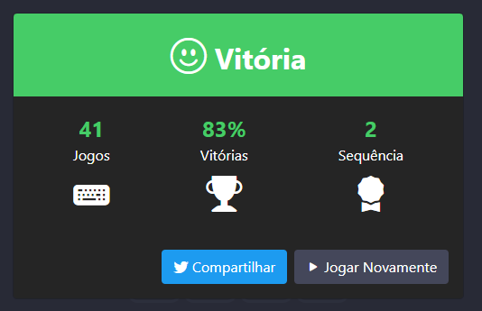
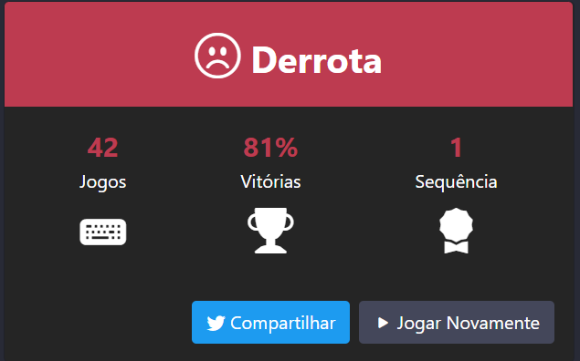

# 🎮 Games 🚧 Em Construção!! 🚧

Projeto gerado com intuito de colocar em práticas os conhecimentos obtidos durante os estudos e poder praticar.

Jogos replicados no projeto:

- Termoo

## Termoo

Jogo inspirado no jogo [term.ooo](https://term.ooo). 🚧 Em Desenvolvimento!! 🚧

### Como o jogo funciona

A cada rodada, uma palavra de 4 letras é escolhida, o objetivo é descobrir a resposta usando como dica as tentativas anteriores observando a cor de cada quadro.

- Verdes: Letra existe na palavra e está na posição certa
- Amarelos: Letra existe na palavra e está na posição errada
- Vermelho: Letra não existe na palavra

Caso você não descubra a palavra em **5 tentativas** você **perde o jogo**. e volta para 0 a sua sequencia de vitórias.

Se você descobrir a palavra antes das **5 tentativas** acabarem você **vence o jogo** e acrescenta 1 a sua sequencia de vitórias.

Em ambos os casos você pode compartilhar seu jogo no **Twitter** e pode jogar novamente seguindo para a próxima palavra.

## Angular

[Angular CLI](https://github.com/angular/angular-cli) versão 13.1.2.

## 🚀 Rodar o Projeto

- Rodar: `ng serve`
- Abrir: `http://localhost:4200/`

## Tecnologias

- Angular
- Bootstrap
